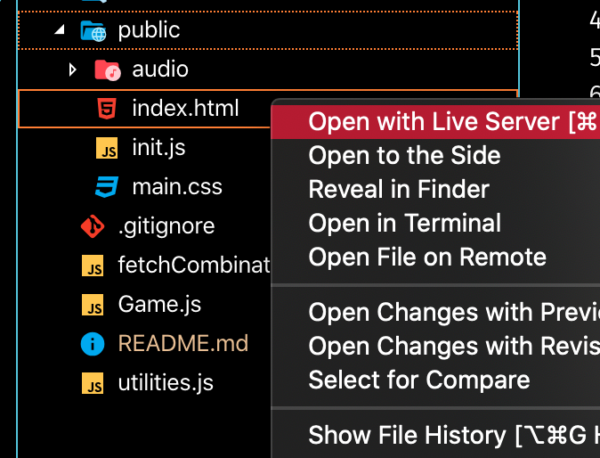
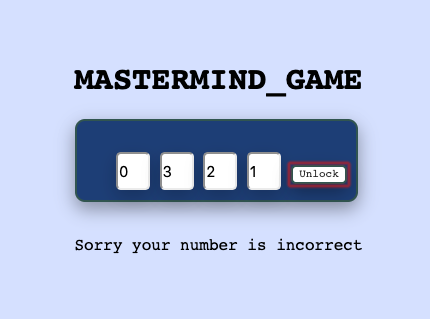
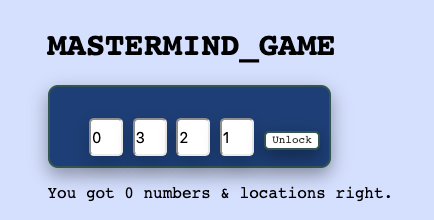
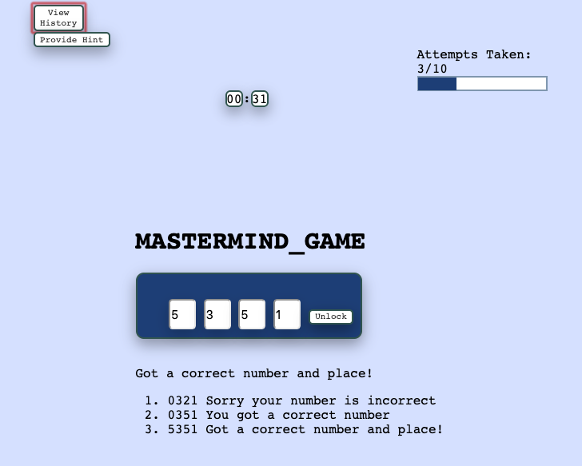

<h1 align="center">Mastermind_Game</h1>

You are pitted against a computer "Master Mind". This is a game where you take turns attempting to
pick a lock. The lock is generated from https://www.random.org/clients/http/api/ API. Random.org is
a true random number generator that generates randomness from atmospheric noise.

**Reasoning:** "Sometimes the best framework is no framework" - I chose to build this with raw HTML/CSS/DOM manipulation to challenge my DOM skills and saw no reason for the added complexity or abstraction a framework provides to build a simple app.

*for best view open on desktop/laptop Chrome Internet Service Provider*

**Development Mode:**

<ol>
     <li>$ git clone https://github.com/erick805/mastermind-game.git</li>
     <li>$ cd mastermind-game</li>
     <li>Install live server vs code extension. https://tinyurl.com/y5p8qc4h</li>
     <li>Find index.html inside public dir. Right click and press "Open with Live Server".</li>
</ol>

<h3>Rules of the Game:</h3>
<li>Game starts immediately after initial load.</li>
<li>You have 10 attempts to get the right combination from digits 0-7.</li>
<li>The computer will provide feedback in three ways after each attempt:</li>

     - `Sorry your number is incorrect`
     - `You got a correct number`
     - `Got a correct number and place!`

<li>The "Provide Hint" Button displays how many numbers you got right && in the right location.</li>

<li> "View History" displays your latest history after you submitted the combination by clicking "Unlock".</li>

## Things to Improve:

- Play Again feature - to restart and create a new instance of game
- Implement time into attempts
- Clear previous rendered history if "View History" is clicked again
- Finish commented out code on dynamically rendering custom amount of locks
- Connect to cloud service or remote database to save and display high scores
